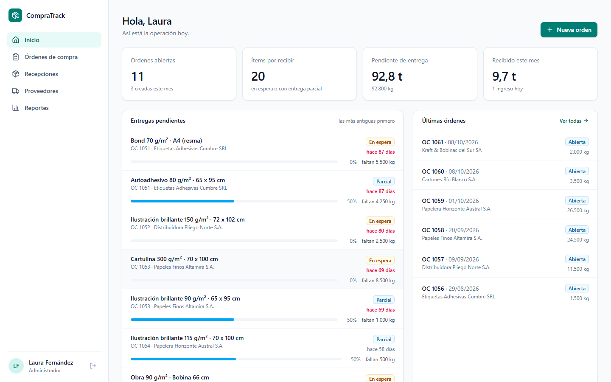
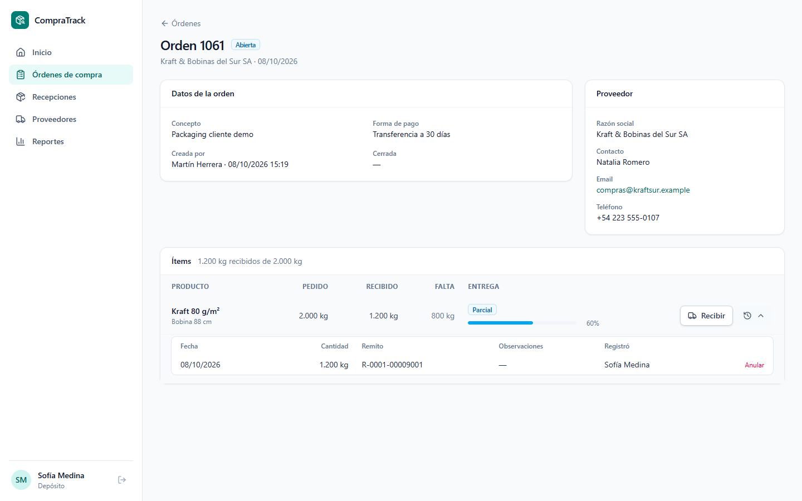
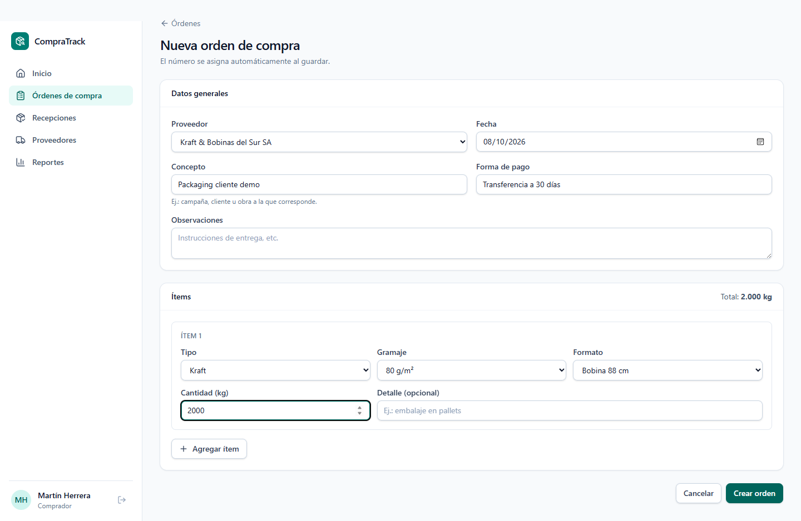
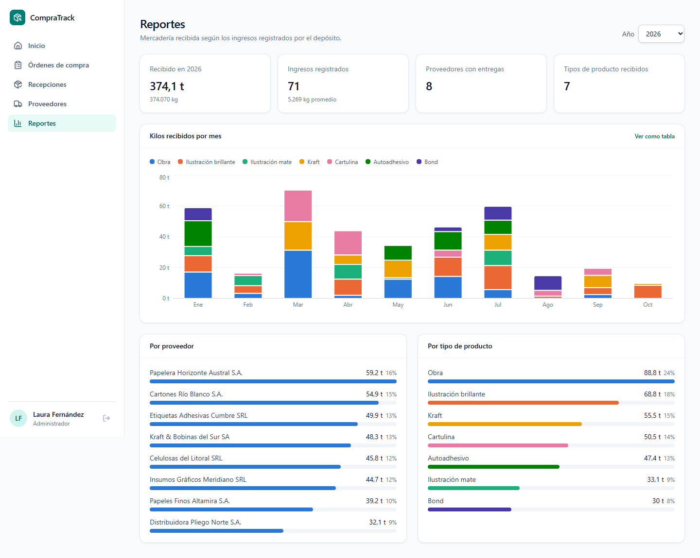
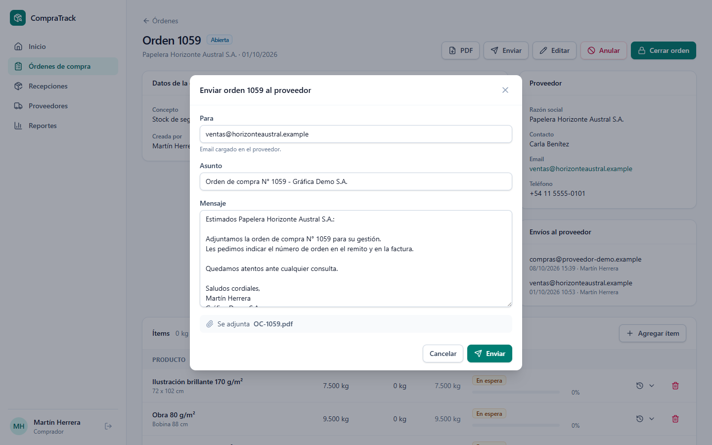

# CompraTrack

Sistema web de gestión de **órdenes de compra** y **recepción de mercadería** para empresas que compran insumos (papel, cartón, etiquetas) a múltiples proveedores.

> Evolución web de un sistema de escritorio (WinForms + SQL Server) que desarrollé y que está en uso real en producción.
> Esta versión fue rediseñada desde cero y usa **datos 100% ficticios**.



## Funcionalidades

- **Órdenes de compra** con numeración correlativa, ítems, cierre, reapertura y anulación
- **PDF de la orden** y **envío por mail** al proveedor con el PDF adjunto, con historial de envíos
- **Entregas parciales:** cada ingreso de mercadería se registra con su remito y el estado de cada ítem se calcula solo (en espera, parcial, completa, excedida)
- **Catálogo por proveedor:** cada proveedor ofrece ciertas combinaciones tipo / gramaje / formato, que alimentan combos en cascada al cargar una orden
- **Roles y permisos granulares:** cada usuario ve y puede hacer solo lo que su rol permite (administrador, comprador, depósito, consulta)
- **Tablero** con indicadores y entregas pendientes, y **reportes** de kilos recibidos por proveedor, tipo de producto y mes
- Interfaz **responsive**: funciona en celular

| | |
|---|---|
|  |  |
|  |  |

## Stack

| Capa | Tecnología |
|---|---|
| Frontend | React 19 · TypeScript · Vite · TanStack Query · React Router · React Hook Form + Zod · Tailwind CSS · Recharts |
| Backend | ASP.NET Core Web API · .NET 10 · Dapper · JWT · BCrypt · QuestPDF · MailKit |
| Base de datos | SQL Server (LocalDB en desarrollo) |
| Tests | xUnit |

### Decisiones técnicas

**Backend**
- **Dapper + SQL explícito** en lugar de un ORM: consultas visibles y optimizables, apoyadas en una vista (`vw_EstadoEntregaItem`) que calcula el estado de entrega de cada ítem.
- **Organización por funcionalidad** (`Features/Ordenes`, `Features/Recepciones`, …): cada módulo agrupa su controller, repositorio y modelos.
- **Reglas de negocio puras** (`ReglasOrden`) separadas del acceso a datos y cubiertas con tests unitarios.
- **Protección ante cambios concurrentes**: los `UPDATE` verifican el estado esperado (`WHERE Estado = 'ABIERTA'`), así un usuario no puede, por ejemplo, registrar un ingreso en una orden que otro acaba de cerrar.
- **Permisos en el JWT** y un atributo `[RequierePermiso(...)]` por endpoint; todo endpoint exige sesión salvo que se indique lo contrario.
- **Envío de mails desacoplado** (`IEnvioCorreo`): en producción sale por SMTP; en desarrollo y en el demo público se guarda como `.eml` y no se envía, para que nadie pueda usar el demo para mandar correos.
- Errores en formato estándar **ProblemDetails** (RFC 9457) con mensajes en español, login con **rate limiting** y documentación **OpenAPI** interactiva.

**Frontend**
- **TanStack Query** para el estado del servidor: caché, reintentos y actualización automática de listados y tablero después de cada cambio.
- **Validación en dos capas**: Zod valida en el navegador para dar respuesta inmediata; la API vuelve a validar todo.
- La interfaz **se adapta a los permisos**: cada botón aparece solo si el usuario puede usarlo y si el estado de la orden lo permite.
- **Filtros en la URL**: los listados se pueden compartir y el botón "atrás" conserva la búsqueda.
- Gráficos con **paleta validada para daltonismo**: cada tipo de producto mantiene su color en todos los gráficos, con leyenda y vista en tabla.

## Cómo levantarlo

Requisitos: [.NET 10 SDK](https://dotnet.microsoft.com/download), [Node.js 22+](https://nodejs.org), [SQL Server LocalDB](https://learn.microsoft.com/sql/database-engine/configure-windows/sql-server-express-localdb) y [sqlcmd](https://learn.microsoft.com/sql/tools/sqlcmd/sqlcmd-utility).

```powershell
# 1. Base de datos con datos de demostración
.\database\crear-base.ps1

# 2. API  →  http://localhost:5137  (documentación en /docs)
dotnet run --project src/backend/CompraTrack.Api --launch-profile http

# 3. Frontend  →  http://localhost:5173   (en otra terminal)
cd src/frontend
npm install
npm run dev
```

### Usuarios demo

Todos con la clave `Demo1234!`. La pantalla de login tiene accesos rápidos para cada uno.

| Usuario | Rol | Puede |
|---|---|---|
| `admin` | Administrador | Todo |
| `compras` | Comprador | Crear y gestionar órdenes, proveedores y catálogo |
| `deposito` | Depósito | Registrar y anular ingresos de mercadería |
| `consulta` | Consulta | Solo lectura |

### Envío de mails

Por defecto (`Correo:Modo = Carpeta`) los mails **no se envían**: se guardan como `.eml` en `src/backend/CompraTrack.Api/correos-enviados/` y se pueden abrir con Outlook o Thunderbird.

Para enviarlos de verdad, configurar SMTP **sin escribir la clave en el repositorio**:

```powershell
cd src/backend/CompraTrack.Api
dotnet user-secrets init
dotnet user-secrets set "Correo:Modo" "Smtp"
dotnet user-secrets set "Correo:Smtp:Servidor" "smtp.gmail.com"
dotnet user-secrets set "Correo:Smtp:Usuario" "tu-cuenta@gmail.com"
dotnet user-secrets set "Correo:Smtp:Clave" "contraseña-de-aplicación"
```

En producción se usan variables de entorno (`Correo__Smtp__Clave`, etc.). Los datos de la empresa que aparecen en el PDF se configuran en la sección `Empresa` de `appsettings.json`.

### Tests y verificación

```powershell
dotnet test                              # tests del backend
cd src/frontend; npm run build; npm run lint   # tipos, build y linter del frontend
```

## Estructura

```
├── database/                 esquema SQL, datos demo y script de creación
├── docs/                     modelo de datos y capturas
├── src/backend/CompraTrack.Api
│   ├── Features/             Auth, Ordenes, Recepciones, Proveedores, Catalogo, Reportes
│   └── Infrastructure/       acceso a datos, autenticación, manejo de errores
├── src/frontend/src
│   ├── api/  auth/  components/  layout/  lib/  pages/
└── tests/CompraTrack.Api.Tests
```

## Próximos pasos

- [ ] Administración de usuarios, roles y permisos desde la interfaz
- [ ] Tests de integración de la API y tests end-to-end del frontend
- [ ] Integración continua con GitHub Actions
- [ ] Demo online

## Documentación

- [Modelo de datos](docs/modelo-datos.md)

## Licencia

[MIT](LICENSE)
