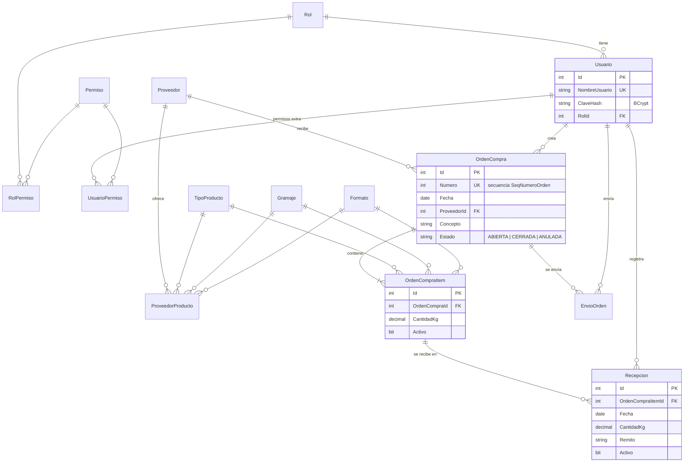

# Modelo de datos

## Reglas principales

- **Permisos efectivos** de un usuario = permisos de su rol ∪ permisos extra (`UsuarioPermiso`). Un rol con `EsAdministrador = 1` tiene todos.
- **Estado de entrega** de cada ítem (vista `vw_EstadoEntregaItem`), según lo recibido contra lo pedido:
  `EN ESPERA` → `ENTREGA PARCIAL` → `ENTREGA COMPLETA`, o `CANTIDAD SUPERADA` si se recibió de más.
- **Numeración** de órdenes con una `SEQUENCE`: nunca se reutiliza un número, aunque la orden se anule.
- **Bajas lógicas** (`Activo = 0`) en ítems y recepciones, para conservar el historial.
- **Historial de envíos** (`EnvioOrden`): cada envío de la orden por mail queda registrado con destinatario, fecha y usuario.
- `ProveedorProducto` define qué combinaciones tipo / gramaje / formato ofrece cada proveedor y alimenta los combos en cascada al cargar una orden.
